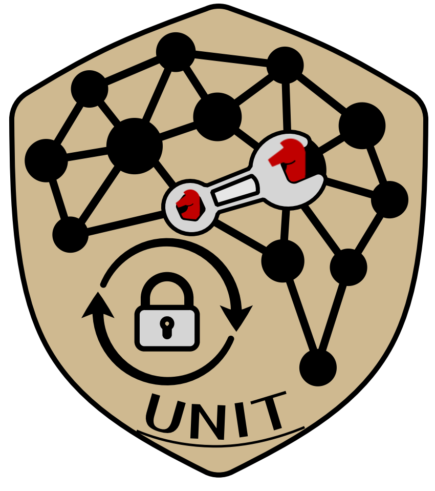
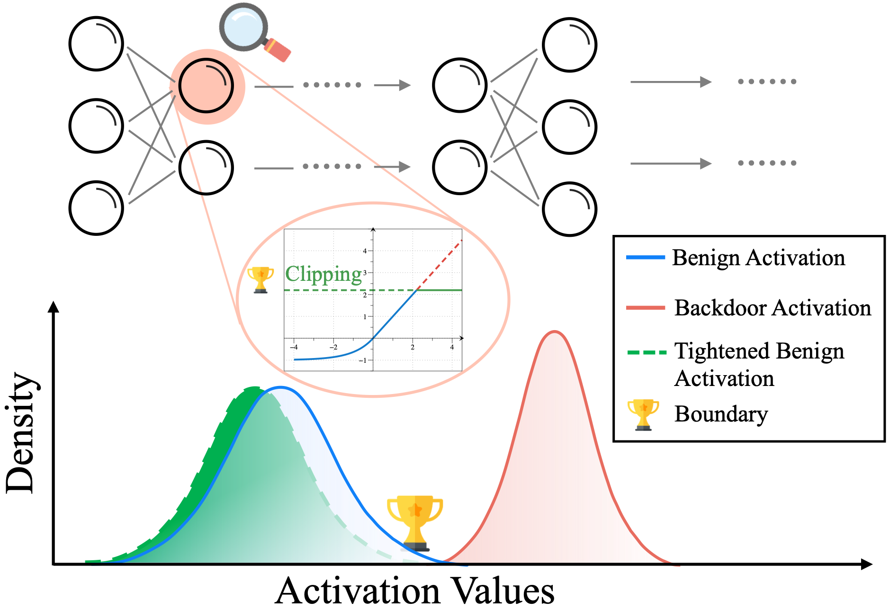

<div align="center">
    
</div>

# UNIT: Backdoor Mitigation via Automated Neural Distribution Tightening


Table of Contents
=================
- [Table of Contents](#table-of-contents)
  - [Overview](#overview)
  - [Code Architecutre](#code-architecture)
  - [Environments](#environments)
  - [Experiments](#experiments)
    - [Usage](#usage)
    - [Configurations](#configurations)
    - [Outputs](#outputs)
  - [Citation](#citation)
  - [Acknowledgement](#acknowledgement)

## Overview
- This is the PyTorch implementation for ECCV 2024 paper "[UNIT: Backdoor Mitigation via Automated Neural Distribution Tightening](https://link.springer.com/chapter/10.1007/978-3-031-73033-7_15)".
- [[arXiv](https://arxiv.org/abs/2407.11372)\] | \[[poster](https://www.cs.purdue.edu/homes/cheng535/static/slides/UNIT_poster.pdf)\]



## Code Architecture
    .
    ├── backdoors                 # Backdoor attack functions
    ├── ckpt                      # Saved models
    ├── data                      # Dataset folder
    ├── models                    # Model architectures
    │   ├── custom_modules.py     # Custom network modules
    │   └── resnet.py             # ResNet models
    ├── evaluate.py               # Evaluation of saved models
    ├── unit.py                   # Main function of backdoor mitigation via UNIT
    └── utils.py                  # Utility functions

## Environments
```bash
# Create python environment (optional)
conda env create -f environment.yml
source activate unit
```

## Experiments  
We provide example code snippets for CIFAR-10 dataset. These can be easily plugged in and modified in `./utils.py`, specifically within the `get_dataset(*)` functions.

### Usage
To evaluate the performance of backdoored models, run:
```bash
CUDA_VISIBLE_DEVICES="0" python evaluate.py --attack badnet
CUDA_VISIBLE_DEVICES="1" python evaluate.py --attack wanet
CUDA_VISIBLE_DEVICES="2" python evaluate.py --attack reflection
```
In this example, we provide three typical backdoored models, i.e., BadNets, WaNet and Reflection
For each model, the code snippet outputs the benign accuracy and attack success rate (ASR), along with a visualization of the trigger, e.g., `demo_badnet.png`.

Apply UNIT to mitigate the backdoor effects:
```bash
CUDA_VISIBLE_DEVICES="0" python unit.py --attack badnet
CUDA_VISIBLE_DEVICES="1" python unit.py --attack wanet
CUDA_VISIBLE_DEVICES="2" python unit.py --attack reflection
```

### Configurations
The specific arguments and hyperparameters used to launch UNIT can be found in `./unit.py`, particularly in lines 377-391.

| Hyperparameter | Default Value | Description |
|----------------|---------------|-------------|
| datadir | "data" | Root directory of data. |
| datadir | "phase" | Option of the program (test or perform UNIT). |
| dataset | "cifar10" | The utilized dataset. |
| network | "resnet18" | The utilized model architecture. |
| attack | "badnet" | Evaluated backdoor attack. |
| seed | 1024 | Random seed for reproducibility. |
| batch_size | 128 | Batch size for training. |
| target | 0 | The attack target label. |
| lr | 0.001 | Learning rate. |
| n_steps | 300 | Number of activation tightening steps. |
| data_rate | 0.05 | Ratio if training data for defense. |
| acc_degrade | 0.03 | Tolerance of accuracy degradation. |


### Outputs
The outputs are displayed directly in the command line. By default, the log is updated every ten steps, showing the cross-entropy loss, regularization loss (indicating the size of the bound), and validation sample accuracy. Additionally, the change in the coefficient ($\alpha$), which adjusts the tightening strength of the activation bound, is reported. Finally, the results (benign accuracy and ASR) before and after applying UNIT are presented.


## Citation
Please cite our paper if you find it useful for your research.😀

```bibtex
@inproceedings{cheng2025unit,
  title={UNIT: Backdoor Mitigation via Automated Neural Distribution Tightening},
  author={Cheng, Siyuan and Shen, Guangyu and Zhang, Kaiyuan and Tao, Guanhong and An, Shengwei and Guo, Hanxi and Ma, Shiqing and Zhang, Xiangyu},
  booktitle={European Conference on Computer Vision},
  pages={262--281},
  year={2025},
  organization={Springer}
}
```

## Acknowledgement
- [BackdoorVault](https://github.com/Gwinhen/BackdoorVault)
- [OrthogLinearBackdoor](https://github.com/KaiyuanZh/OrthogLinearBackdoor)
- [LOTUS](https://github.com/Megum1/LOTUS)
